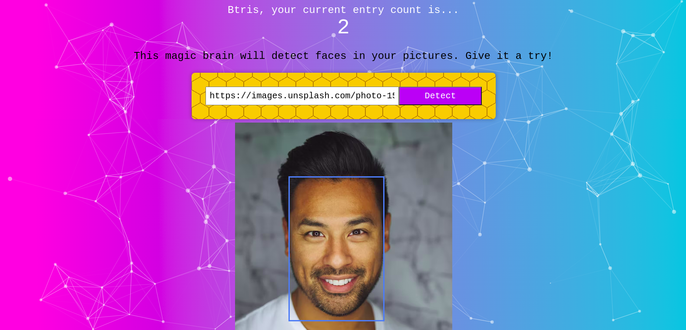

# Smart Brain - A face detection app.

## Welcome! 👋
This is a React.js project. It uses the Clarifai api face detection model to detect the face in an image. This app is connected to its own separate server that stores a users details.

## How To Run? 🤔
Download this code either as a `zip file` or use the `git clone` command to clone it.
Then, open the project folder in your editor and on the integrated terminal:
-  Run `npm install` to install all the packages used for this project.
After the installation,
- Run `npm start` to run the project on your browser localhost.
    That's all you'd need to do 🙂

## Want To Contribute? 
Feel free to open a pull request on this repository is there's any feature you'd like to add to this app!

## Have A Feedback? 
Giving feedback is appreciated, if you any to give on this project please email beatriceebirim@gmail.com.

**Happy Coding 💪**
